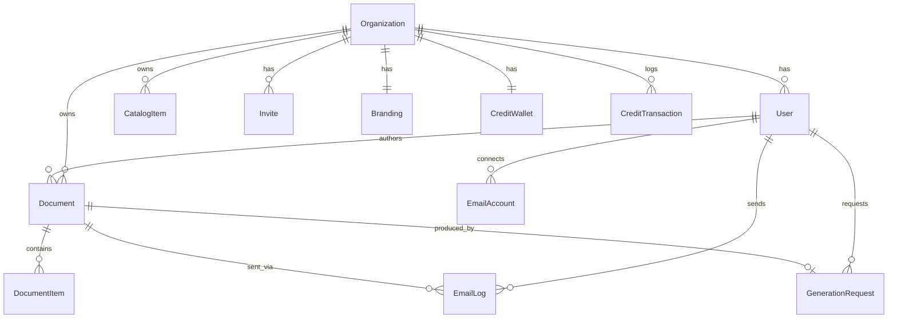

# 아키텍처

## 레이어 개요

```
브라우저
  │
  ▼
Next.js App Router (src/app)
  ├─ 페이지 (서버 컴포넌트 기본)  ── 데이터 조회 ──┐
  ├─ 페이지 전용 클라이언트 컴포넌트 (_components)  │
  └─ REST API Route Handlers (src/app/api) ───────┤
                                                   ▼
                                     src/lib/db.ts (Prisma 싱글톤)
                                                   │
                                                   ▼
                                     Prisma 7 + better-sqlite3
                                                   │
                                                   ▼
                                            SQLite (dev.db)
```

- **데이터 조회**: 화면은 서버 컴포넌트에서 `prisma` 로 직접 조회한다 (SSR). 외부/클라이언트 호출은 `/api/*` 라우트를 사용한다.
- **쓰기 액션**: MVP 단계에서는 일부를 `sonner` toast 목업으로 처리하고, 실제 기록이 필요한 흐름(문서 생성·발송)은 API 라우트에서 SQLite 에 반영한다.
- **세션**: `src/lib/session.ts` 가 데모 고정 사용자/조직을 반환한다 (인증 미구현). 교체 지점이 이 한 파일에 격리되어 있다.

## 라우트 그룹

| 그룹 | 레이아웃 | 대상 |
|---|---|---|
| `(user)` | 사이드바(영업 포털) | 영업 담당자 화면 |
| `(admin)` | 사이드바(관리자 콘솔) | 관리자 화면 |
| `(auth)` | 중앙 정렬(사이드바 없음) | 로그인 등 |

라우트 그룹 `()` 은 URL 에 노출되지 않으므로, `/settings/email`(user)과 `/settings/branding`(admin)처럼 최종 경로만 겹치지 않으면 서로 다른 레이아웃을 가질 수 있다.

## 도메인 모델



| 모델 | 역할 |
|---|---|
| `Organization` | 팀/회사. 모든 데이터의 최상위 소유자 |
| `User` | 사용자. `role` = SALES_REP · LEADER · ADMIN |
| `Invite` | 팀원 초대 (PENDING/ACCEPTED/EXPIRED) |
| `Document` | 영업 문서. `type`(QUOTE/CONTRACT/NDA/PROPOSAL) · `status`(DRAFT/SENT/COMPLETED) · `amount`(KRW 정수) |
| `DocumentItem` | 문서 라인 아이템 (수량·단가·금액) |
| `CatalogItem` | 마스터 데이터(상품/서비스 카탈로그) |
| `EmailAccount` | Gmail/Outlook 연동 계정 |
| `EmailLog` | 이메일 발송 이력 |
| `CreditWallet` / `CreditTransaction` | 조직 크레딧 잔액 / 충전·사용 내역 |
| `GenerationRequest` | AI 문서 생성 요청 이력 |
| `Branding` | 조직 브랜딩(회사명·로고·색상) |
| `Policy` | 기획서 정책 라이브러리(24) |

전체 필드는 `prisma/schema.prisma` 참고.

## enum 대체 전략

SQLite 는 enum 을 지원하지 않으므로, 열거형은 `String` 컬럼 + `src/lib/constants.ts` 의 상수/라벨로 관리한다. 예:

```ts
DOCUMENT_STATUSES = ["DRAFT", "SENT", "COMPLETED"]
DOCUMENT_STATUS_LABELS = { DRAFT: "초안", SENT: "발송완료", COMPLETED: "계약완료" }
```

DB 에는 영문 코드가 저장되고, UI 에는 한국어 라벨을 표시한다.

## 데이터 흐름 예시

**AI 문서 생성** (`POST /api/generate`)
1. 크레딧 잔액 확인 (부족 시 402)
2. 트랜잭션: 문서(+라인아이템) 생성 → 크레딧 차감 → 거래내역 기록 → 생성요청 이력 기록
3. 생성된 문서 반환 → 에디터로 이동

**이메일 발송** (`POST /api/documents/:id/send`)
1. 수신자 검증
2. 트랜잭션: `EmailLog` 생성 → 문서 `status = SENT` 전환

## 향후 확장 포인트

- **인증**: `src/lib/session.ts` 를 실제 인증(NextAuth 등)으로 교체
- **AI 연동**: `/api/generate` 목업을 실제 LLM(Anthropic API) 호출로 교체
- **메일 발송**: OAuth 토큰 저장 + 실제 Gmail/Outlook API 연동
- **상태 화면**: 각 라우트에 `loading.tsx` · `error.tsx` · `not-found.tsx` 추가
