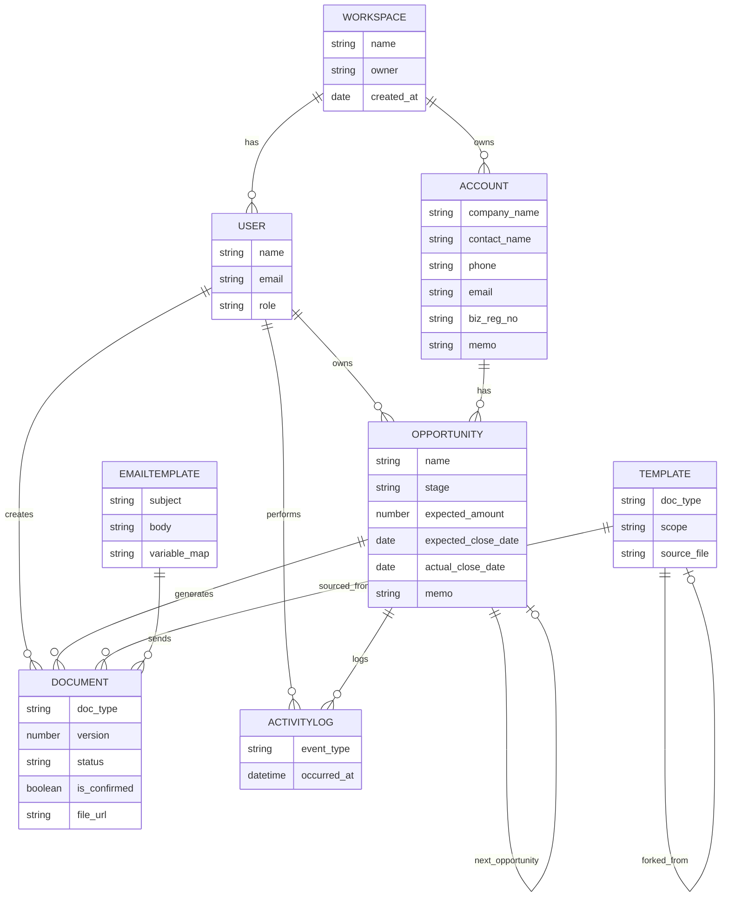

# AI 영업 문서 자동화 SaaS — PRD

**견적서·계약서 생성부터 발송까지, 영업 기회 관리와 매출 예측을 하나로**

| 항목 | 내용 |
|---|---|
| 문서 버전 | v1.0 (초안) |
| 작성일 | 2026-08-01 |
| 문서 상태 | Draft — 검토 대기 |
| 대상 독자 | 제품 기획, 디자인, 엔지니어링, 세일즈/CS 팀 |
| 관련 산출물 | 사용자 워크플로우 정의서 (첨부 원본) |

> **"영업 기회를 관리하고, AI로 견적서·계약서를 만들고, 바로 이메일로 보낸다."**

---

## 목차

1. [문서 개요](#1-문서-개요)
2. [제품 목표 및 성공 지표](#2-제품-목표-및-성공-지표)
3. [핵심 사용자 워크플로우](#3-핵심-사용자-워크플로우)
4. [기능 요구사항](#4-기능-요구사항)
5. [조직/협업 기능 (Organization Features)](#5-조직협업-기능-organization-features)
6. [정보 구조 및 핵심 데이터 모델](#6-정보-구조-및-핵심-데이터-모델)
7. [비기능 요구사항](#7-비기능-요구사항)
8. [MVP 범위 정의](#8-mvp-범위-정의)
9. [리스크 및 오픈 이슈](#9-리스크-및-오픈-이슈)
10. [향후 로드맵](#10-향후-로드맵-mvp-이후)

---

## 1. 문서 개요

### 1.1 목적

본 문서는 AI 기반 영업 문서 자동화 SaaS의 MVP(Minimum Viable Product) 범위와 기능 요구사항을 정의한다. 목표는 영업 담당자가 거래처·기회 발굴부터 견적서/계약서 작성, 이메일 발송, 매출 마감까지 전 과정을 하나의 워크스페이스에서 처리할 수 있도록 지원하는 것이다.

이 PRD는 첨부된 "사용자 워크플로우" 정의서를 기반으로 각 단계를 기능 요구사항으로 구체화하고, 향후 개발·디자인 논의의 단일 기준점(Single Source of Truth) 역할을 한다.

### 1.2 배경 및 문제 정의

중소·스타트업 영업 조직은 다음과 같은 문제를 반복적으로 겪는다.

- 견적서·계약서를 매번 워드/한글 파일을 열어 수작업으로 복사·수정하며 시간을 낭비한다.
- 영업 기회(Opportunity)가 이메일, 메신저, 엑셀 등에 흩어져 있어 파이프라인 전체를 한눈에 파악하기 어렵다.
- 견적서 → 계약서로 넘어가는 과정에서 어떤 버전이 '확정본'인지 추적이 안 되어 실수가 발생한다.
- Salesforce와 같은 CRM은 기능이 방대하고 비싸며, 정작 한국 중소기업이 많이 쓰는 '문서 작업' 자체는 지원하지 않는다.

본 제품은 "CRM의 기회 관리"와 "AI 문서 자동화"를 하나로 묶어, 이 두 문제를 동시에 해결하는 것을 목표로 한다.

---

## 2. 제품 목표 및 성공 지표

### 2.1 비즈니스 목표

1. 영업 문서(견적서/계약서) 작성 소요 시간을 기존 대비 70% 이상 단축한다.
2. 영업 기회의 단계별 전환율과 예상 매출을 실시간으로 파악할 수 있게 한다.
3. 문서 작성 → 발송 → 기회 상태 변경이 끊김 없이 이어지는 단일 워크플로우를 제공한다.

### 2.2 MVP 핵심 성공지표 (KPI)

| 구분 | 지표 | 목표치 (출시 후 3개월) |
|---|---|---|
| 활성화 | 가입 후 7일 내 첫 견적서 생성 완료율 | 60% 이상 |
| 핵심 사용 | 월간 활성 워크스페이스당 평균 생성 문서 수 | 10건 이상 |
| 전환 | 견적서 발송 → 계약 체결 전환율 추적 가능 여부 | 100% 트래킹 |
| 효율 | AI 초안 생성 후 사람이 수정하는 평균 시간 | 5분 이하 |
| 리텐션 | 8주차 워크스페이스 유지율 | 40% 이상 |

### 2.3 타겟 사용자 및 페르소나

**페르소나 A — 1인/소규모 영업대표 "김대표"**
- 5인 이하 소기업 대표 또는 프리랜서 영업 담당.
- 견적서/계약서를 한글·워드 템플릿을 매번 복사해서 쓰고 있음.
- 니즈: 빠르게, 실수 없이, 전문적으로 보이는 문서를 만들고 싶다.

**페르소나 B — 스타트업 영업팀 매니저 "박매니저"**
- 3~10인 영업팀을 관리하며 팀 전체 파이프라인과 이번 달 매출 예측이 필요함.
- 니즈: 누가 어떤 기회를 어느 단계까지 진행했는지, 이번 달/다음 달 매출이 얼마나 될지 알고 싶다.

---

## 3. 핵심 사용자 워크플로우

아래 흐름은 첨부된 사용자 워크플로우 정의서를 기능 관점에서 재구성한 것이다. 전체 여정은 크게 (A) 초기 세팅, (B) 영업 기회 발생 및 문서 생성/발송 루프, (C) 수주 및 다음 기회 자동 생성, (D) 대시보드 확인 4단계로 구성된다.

### 3.1 A. 온보딩 및 초기 세팅

1. 회원가입 및 로그인 (이메일 기반)
2. 워크스페이스 생성
3. 초기 문서 세팅 — [문서 보관함 > 공용 문서함 > 표준 양식]에서 기존에 쓰던 파일(양식)을 업로드하고, 자연어 프롬프트로 AI가 초기 표준 문서(견적서/계약서 템플릿)를 세팅
4. 생성된 문서를 에디터에서 확인 및 수동 편집
5. 메일 발송에 사용할 메일 템플릿 등록 (담당자명·고객사명 등 변수 매핑 포함)

### 3.2 B. 영업 기회 발생 → 문서 생성·발송 루프

영업 건이 발생하면 다음 흐름이 반복된다 (견적서 단계와 계약서 단계는 구조가 동일하며, 순번은 실제 플로우 문서의 4.1~4.12에 대응한다).

1. 기회 관리 진입 — 수동 생성 또는 이메일 기록/통화 내역 기반 자동 생성
2. 거래처(계정) 생성 — 회사명, 담당자명, 핸드폰 번호, 이메일, 사업자번호, 메모
3. 기회(Opportunity) 생성 — 관리 포인트(단계, 예상금액, 마감일 등) 설정
4. 견적서 생성 — 문서함에서 양식을 불러오고, 불러온 문서 기반으로 AI가 초안 자동 생성
5. 견적서 편집 — 에디터에서 수동 수정
6. 견적서 저장 — 문서함에 자동 저장 (버전 이력 관리)
7. 견적서 발송 — 메일 템플릿을 불러와 담당자명·고객사명 자동 입력, 견적서 파일 자동 첨부 후 발송 버튼 클릭 → 기회 상태가 '초기'에서 '제안'으로 자동 변경
8. 고객사와의 협의("티키타카")에 따라 4~7단계를 반복
9. 계약서 생성 — 문서 불러오기 + 확정된 견적서 기반 AI 자동 생성 (이때 어떤 견적서가 '확정본'인지 파일 히스토리에서 확인)
10. 계약서 편집 및 저장 (문서함 자동 저장)
11. 계약서 발송 → 기회 상태가 '제안'에서 '검토 및 협상'으로 자동 변경, 이후 8~11단계 반복
12. 수주 처리 — 대시보드/매출에 반영, 동시에 '다음 기회를 생성할지' 여부를 팝업으로 확인

### 3.3 C. 다음 기회 자동 생성

수주 처리 시점에 사용자가 확인하면, 재계약·후속 영업을 위한 다음 기회가 기회 캘린더에 자동으로 예약(스케줄링)된다.

### 3.4 D. 대시보드에서 전체 현황 파악

- 현재/이번 달 매출액 통계
- 계약서 협상("티키타카") 진행 현황 통계
- 다음 기회에 대한 예상 매출액
- 다음 기회의 재계약/폐기 관련 이탈률 통계

---

## 4. 기능 요구사항

MVP는 크게 4개 모듈로 구성된다: (1) 영업 기회 관리(CRM), (2) AI 영업 문서 생성·관리, (3) 기회 캘린더, (4) 대시보드. 각 모듈의 요구사항은 우선순위(**P0**=MVP 필수, **P1**=출시 직후, **P2**=추후 고도화)로 구분한다.

### 4.1 모듈 1 — 영업 기회 관리 (CRM)

**4.1.1 거래처(Account) 관리**

| ID | 요구사항 | 우선순위 |
|---|---|---|
| F-101 | 거래처 신규 생성: 회사명, 담당자명, 직책, 핸드폰번호, 이메일, 사업자등록번호, 메모 필드 입력 | P0 |
| F-102 | 거래처 목록 조회/검색/필터 (회사명, 담당자명 기준) | P0 |
| F-103 | 거래처 상세 페이지에서 연관된 모든 기회·문서·이메일 이력 조회 | P0 |
| F-104 | 이메일 수신/통화 로그 연동을 통한 거래처 자동 인식 및 매칭 제안 | P2 |

**4.1.2 기회(Opportunity) 관리**

| ID | 요구사항 | 우선순위 |
|---|---|---|
| F-111 | 기회 수동 생성: 거래처 연결, 기회명, 예상 금액, 예상 마감일(Close Date), 담당자, 메모 | P0 |
| F-112 | 기회 단계(Stage) 관리: 초기 → 제안 → 검토/협상 → 수주/실주, 칸반보드 형태로 드래그 이동 지원 | P0 |
| F-113 | 문서 발송 액션과 연동한 단계 자동 전이 (견적서 발송 시 '제안'으로, 계약서 발송 시 '검토/협상'으로 자동 변경) | P0 |
| F-114 | 기회별 타임라인: 생성 문서, 발송 이력, 상태 변경 이력을 시간순으로 표시 | P1 |
| F-115 | 수주 처리 시 매출 실적에 자동 반영 + '다음 기회 생성' 여부 확인 팝업 | P0 |
| F-116 | 이메일 수신함/통화 내역 기반 기회 자동 생성 제안(초안) | P2 |
| F-117 | 실주(폐기) 처리 시 사유 선택(가격/경쟁사/일정 등) 및 이탈률 통계 반영 | P1 |

### 4.2 모듈 2 — AI 영업 문서 생성·관리

**4.2.1 문서 보관함 (표준 양식 관리)**

| ID | 요구사항 | 우선순위 |
|---|---|---|
| F-201 | 문서 보관함 구조: 공용 문서함(표준 양식) / 개인 문서함(생성된 문서) 이원화 | P0 |
| F-202 | 기존 사용 중인 양식 파일 업로드 (docx, pdf, hwp → 자동 변환) | P0 |
| F-203 | 업로드한 양식 + 자연어 프롬프트로 초기 표준 문서(견적서/계약서 템플릿) AI 세팅 | P0 |
| F-204 | 표준 양식별 변수 필드 정의 (고객사명, 담당자명, 품목, 단가, 수량, 계약기간 등) | P0 |

**4.2.2 AI 문서 생성 (견적서/계약서)**

| ID | 요구사항 | 우선순위 |
|---|---|---|
| F-211 | 기회 상세 화면에서 문서 유형 선택(견적서/계약서) 후 표준 양식 불러오기 | P0 |
| F-212 | 불러온 양식 + 기회/거래처 정보를 기반으로 AI가 문서 초안 자동 생성 (품목, 금액, 조건 등 자동 채움) | P0 |
| F-213 | 계약서 생성 시 '확정된 견적서'를 소스로 선택하여 견적 내용을 그대로 계약 조건에 반영 | P0 |
| F-214 | 문서 히스토리(버전) 관리: 각 버전에 "확정본" 체크박스(독립 플래그)를 두어 사용자가 수동으로 지정, 여러 버전을 동시에 확정본으로 지정 가능 | P0 |
| F-215 | AI 재생성/부분 재작성: 특정 조항만 자연어로 수정 요청 가능 (예: '결제조건을 30일로 변경') | P1 |
| F-216 | 표준 라이브러리\*에서 사용자가 원하는 조항을 직접 선택/불러와 문서에 삽입 | P2 |

> \* 라이브러리: 비밀유지, 손해배상, 관할법원, 지식재산권 등 계약서에 자주 쓰이는 조항 단위를 미리 정리해둔 모음. 사용자가 필요한 조항을 목록에서 직접 골라 문서에 불러와 넣는 방식이다.

**4.2.3 문서 에디터**

| ID | 요구사항 | 우선순위 |
|---|---|---|
| F-221 | 웹 기반 리치 텍스트 에디터로 AI 생성 문서 직접 수정 (표, 서식 포함) | P0 |
| F-222 | 에디터 편집 중 임시저장(자동/수동) 기능 — 편집 내용을 문서함에 임시 버전으로 저장하여 이탈 시에도 유실되지 않도록 함 | P0 |
| F-223 | PDF 미리보기 및 다운로드 | P0 |
| F-224 | 전자서명 연동(수신자 서명 요청) | P2 |

**4.2.4 이메일 발송**

| ID | 요구사항 | 우선순위 |
|---|---|---|
| F-231 | 메일 템플릿 등록/관리 (변수: 담당자명, 고객사명, 회사명 등) | P0 |
| F-232 | 발송 시 메일 템플릿에 거래처 정보 자동 입력 + 해당 문서(PDF) 자동 첨부 | P0 |
| F-233 | 발송 버튼 클릭 한 번으로 메일 발송 + 기회 상태 자동 전이 | P0 |
| F-234 | 발송 이력 및 열람 여부(오픈 트래킹) 확인 | P1 |
| F-235 | 이메일 발송 시 해당 문서(견적서/계약서)의 상태가 "발송 전" → "발송 완료"로 자동 전환되며, 문서함/기회 상세의 문서 목록에서 상태 배지로 표시 | P0 |

### 4.3 모듈 3 — 기회 캘린더

**레이아웃**: 좌측 70% 월별 캘린더 / 우측 30% "선택한 날짜의 기회 리스트 + 상세 패널"로 구성된 2-pane 뷰.

| ID | 요구사항 | 우선순위 |
|---|---|---|
| F-301 | 2-pane 레이아웃: 좌측 70% 월별 캘린더, 우측 30% 선택 날짜의 기회 리스트/상세 패널 | P0 |
| F-302 | 월 상단 요약바: 이번 달 예상 매출 합계·마감 기회 수를 고정 노출, 월 이동 시 해당 월 기준으로 자동 갱신 | P0 |
| F-303 | 날짜 셀 "요약형" 보기: 기회 개수만큼 물방울 아이콘 표시, 진행 상태별 색상 구분(협상=주황 / 임박=빨강 / 수주=초록) | P0 |
| F-304 | 날짜 셀 "목록형" 보기: 기회명을 텍스트 리스트로 표시. 상단 토글로 요약형/목록형 전환 | P1 |
| F-305 | 우측 패널 기회 카드: 기회명·거래처·예상금액·단계·담당자 표시. 카드의 확장 아이콘 클릭 시 모달 오버레이로 기회 페이지 전체를 표시하고 X 버튼으로 닫아 캘린더로 복귀(페이지 전환 없음) | P0 |
| F-306 | 수주 처리 시 '다음 기회'가 자동으로 캘린더에 스케줄링되어 표시 | P0 |

> 팀 필터(내 기회/팀 전체/특정 멤버 보기)는 조직 도입 이후 기능이므로 5.6 캘린더 조직 확장에서 정의한다.

### 4.4 모듈 4 — 대시보드

| ID | 요구사항 | 우선순위 |
|---|---|---|
| F-401 | 현재/이번 달 매출액(수주 완료 기준) 통계 위젯 | P0 |
| F-402 | 파이프라인 단계별 기회 수 및 예상 금액 합계 | P0 |
| F-403 | 계약서 협상 진행 통계 (평균 왕복 횟수, 평균 소요일 등 '티키타카' 지표) | P1 |
| F-404 | 향후 기회에 대한 예상 매출액(가중 파이프라인: 단계별 확률 × 예상 금액) | P0 |
| F-405 | 재계약/폐기(이탈) 관련 이탈률 통계 및 추이 | P1 |
| F-406 | 기간(주/월/분기) 및 담당자별 필터링\*\* | P1 |
| F-407 | 대시보드 상단 "내 대시보드 / 팀 대시보드" 토글 — 팀 대시보드 선택 시 위 지표들이 팀 전체 기준으로 집계되어 표시됨(조직 도입 이후 활성화, 5.4 참고) | P1 |

> \*\* 담당자별 필터는 다중 사용자(조직)를 전제로 하는 기능으로, 1인 사용 MVP 단계에서는 의미가 없으며 5장 조직 기능 도입 이후 실질적으로 동작한다.

---

## 5. 조직/협업 기능 (Organization Features)

MVP가 1인 사용을 전제로 설계된 것과 달리, 조직(팀) 단위로 워크스페이스를 공유할 때 필요한 권한·협업·자산 관리 기능을 정의한다. 아래 기능은 MVP 이후 조직 도입 단계에서 순차적으로 반영한다.

### 5.1 권한과 소유권 (Role & Ownership)

| ID | 요구사항 | 우선순위 |
|---|---|---|
| F-501 | 역할 2단계 구조: 관리자(Admin) / 멤버(Member) | P0 |
| F-502 | 거래처(Account)는 Owner를 지정하지 않고 조직 공용 자산으로 취급 | P0 |
| F-503 | 기회(Opportunity)는 생성한 사람이 자동으로 Owner로 지정 | P0 |

### 5.2 편집 권한 및 협업

| ID | 요구사항 | 우선순위 |
|---|---|---|
| F-511 | 문서(견적서/계약서 등)는 생성자만 편집 가능 | P0 |
| F-512 | 기회 편집 권한은 워크스페이스 설정에서 관리자가 정책 선택: "생성자만 편집" 또는 "전체 멤버 편집 가능" 중 택1 (조회는 항상 전체 공개) | P0 |
| F-513 | 기회 상세 화면에 자유 텍스트 "메모" 필드 추가 — 멘션·알림 없는 최소 버전의 협업 로그 | P1 |

### 5.3 조직 단위 템플릿/자산 관리

| ID | 요구사항 | 우선순위 |
|---|---|---|
| F-521 | 관리자가 특정 멤버에게 공용 표준 양식 생성/편집 권한을 부여 | P0 |
| F-522 | 멤버는 공용 표준 양식을 개인 문서함으로 복제(Fork)하여 자유롭게 수정 가능 | P0 |
| F-523 | 문서 생성 시 공용 표준 양식 또는 개인화된 양식을 소스로 선택 가능 (공용 표준 양식(관리자 통제) → 개인 양식(자유 편집) → 실제 문서(기회별 생성)의 3단 구조) | P0 |

### 5.4 조직 대시보드/리포팅

4.4의 F-407 "내 대시보드 / 팀 대시보드" 토글에서 **팀 대시보드**를 선택하면, F-401~F-404 지표가 팀 전체 기준으로 자동 집계되어 표시된다(별도 화면이 아니라 동일 대시보드의 확장 모드). 조직 도입 시 아래 지표를 추가로 제공한다.

| ID | 요구사항 | 우선순위 |
|---|---|---|
| F-532 | 팀원별 실적 비교(개인별 수주 금액, 진행 중 기회 수) | P0 |
| F-533 | 팀원별/팀 전체 쿼터(목표) 대비 달성률 표시 | P1 |

### 5.5 계정/멤버 관리

| ID | 요구사항 | 우선순위 |
|---|---|---|
| F-541 | 관리자가 이메일로 멤버를 워크스페이스에 초대 | P0 |
| F-542 | 관리자가 멤버 목록에서 멤버 추가/제거 | P0 |

> 요금제·결제(Billing) 로직은 본 범위에서 제외하며, 순수 멤버 관리 기능만 포함한다.

### 5.6 캘린더 조직 확장

| ID | 요구사항 | 우선순위 |
|---|---|---|
| F-551 | 4.3 기회 캘린더에 팀 필터 추가: 내 기회만 보기 / 팀 전체 보기 / 특정 멤버 선택 | P0 |

### 5.7 제외 항목 (Out of Scope)

- 승인/결재 플로우 (견적 할인율 초과 시 매니저 승인 등)
- 리드 배분(Lead Routing) — 리드는 계속 수동 생성
- 정식 댓글/멘션·알림 기반 협업 (5.2의 메모 필드로 최소 대체)
- 마감 임박 알림/에스컬레이션
- 거래처 중복 자동 감지/병합

---

## 6. 정보 구조 및 핵심 데이터 모델

아래는 MVP에 필요한 핵심 엔티티와 주요 속성, 관계를 정리한 개념 데이터 모델이다. 실제 스키마 설계 시 세부 타입/제약조건은 엔지니어링 팀에서 구체화한다.

| 엔티티 | 주요 속성 | 관계 |
|---|---|---|
| Workspace | 이름, 소유자, 생성일 | 1 : N User, 1 : N Account |
| User (사용자) | 이름, 이메일, 역할(Admin/Member) | N : 1 Workspace |
| Account (거래처) | 회사명, 담당자명, 직책, 연락처, 이메일, 사업자번호, 메모 | 1 : N Opportunity |
| Opportunity (기회) | 기회명, 단계(Stage), 예상금액, 예상 마감일, 실제 수주일, 담당자(Owner→User), 메모, 이전 기회 참조 | 1 : N Document |
| Document (문서) | 유형(견적서/계약서), 버전, 상태(초안 → 발송 전 → 발송 완료), 확정본 여부(별도 플래그, 다중 지정 가능), 생성자(Owner→User), 파일링크, 생성 프롬프트 | N : 1 Opportunity |
| Template (표준 양식) | 유형, 원본 파일, 변수 필드 정의, 범위(공용/개인), 원본 템플릿 참조(Fork Parent) | 1 : N Document |
| EmailTemplate (메일 템플릿) | 제목, 본문, 변수 매핑, 첨부 규칙 | N : N Document 발송 |
| ActivityLog (활동 이력) | 이벤트 유형, 발생 시각, 수행자(Actor→User), 관련 엔티티 | N : 1 Opportunity |

---

## 7. 비기능 요구사항

### 7.1 보안 및 개인정보
- 거래처의 개인정보(담당자 연락처, 이메일)는 암호화하여 저장한다.
- 워크스페이스 간 데이터는 완전히 격리(Tenant Isolation)한다.
- 문서 파일은 접근 권한이 있는 워크스페이스 멤버만 열람 가능해야 한다.

### 7.2 성능
- AI 문서 초안 생성은 평균 10초 이내에 완료되어야 한다.
- 칸반보드/캘린더는 기회 500건 기준으로 2초 이내 렌더링되어야 한다.

### 7.3 신뢰성
- 이메일 발송 실패 시 재시도 및 사용자 알림 로직을 갖춘다.
- 문서 자동 저장은 유실 없이 버전 이력이 보존되어야 한다.

### 7.4 확장성
- 문서 유형(견적서/계약서) 추가가 코드 변경 없이 템플릿 등록만으로 가능해야 한다.
- 추후 전자서명, 회계/ERP 연동 등의 외부 연동을 고려한 API 구조를 지향한다.

---

## 8. MVP 범위 정의

### 8.1 포함 범위 (In Scope)
- 워크스페이스 생성 및 초기 표준 문서 세팅(AI + 업로드 양식)
- 거래처 및 기회 관리 (수동 생성, 칸반 단계 관리)
- AI 기반 견적서/계약서 생성 및 웹 에디터 수정
- 메일 템플릿 기반 문서 발송 및 기회 상태 자동 전이
- 월별 기회 캘린더
- 기본 대시보드 (매출 통계, 파이프라인 현황, 예상 매출)

### 8.2 제외 범위 (Out of Scope, 추후 고도화)
- 이메일/통화 내역 기반 기회·거래처 자동 생성 (F-116, F-104)
- 전자서명 연동 (F-224)
- 문서 내 부분 재작성 자연어 편집 (F-215)
- 법무 조항 라이브러리 (F-216)
- 고급 이탈률/협상 통계 대시보드 (F-403, F-405)
- 조직/협업 기능 전체 (5장) — 1인 사용 MVP 이후 조직 도입 단계에서 반영

---

## 9. 리스크 및 오픈 이슈

| 구분 | 내용 | 대응 방향 |
|---|---|---|
| AI 품질 | AI가 생성한 견적/계약 조건에 오류가 있을 경우 법적 리스크 발생 가능 | 발송 전 사용자 최종 확인 단계를 필수화(사람이 항상 검토 후 발송) |
| 문서 파싱 | 사용자가 업로드하는 기존 양식(hwp, 복잡한 표 포함 docx)의 파싱 정확도 | 1차는 docx/pdf 우선 지원, hwp는 변환 품질 검증 후 순차 지원 |
| 상태 전이 정합성 | 기회 단계와 문서 상태가 어긋나는 엣지 케이스(예: 발송 후 재수정) | 문서 상태와 기회 단계를 분리 관리하되 이벤트 기반으로 동기화 |
| 확정본 판별 | 어떤 견적서가 '확정본'인지 사용자가 명시적으로 지정하지 않는 경우 | 발송된 최신 버전을 기본 확정본으로 간주하되 사용자가 추가로 다른 버전에도 확정본 플래그를 지정할 수 있도록 UI 제공 |

---

## 10. 향후 로드맵 (MVP 이후)

1. 조직/협업 기능(5장) 적용 — 권한/소유권, 편집 정책, 조직 템플릿, 조직 대시보드, 멤버 관리
2. 이메일 수신함/통화 내역 연동을 통한 기회·거래처 자동 생성
3. 전자서명 연동으로 계약 체결까지 원스톱 처리
4. 법무 조항 라이브러리 및 리스크 자동 검토(AI 계약 리뷰)
5. 승인/결재 워크플로우(할인율 초과 시 매니저 승인 등), 마감 임박 알림, 정식 댓글/멘션 협업
6. 회계/ERP(더존, 세일즈포스 등) 연동
7. 협상 반복 횟수, 이탈 사유 등 고급 영업 분석 대시보드
